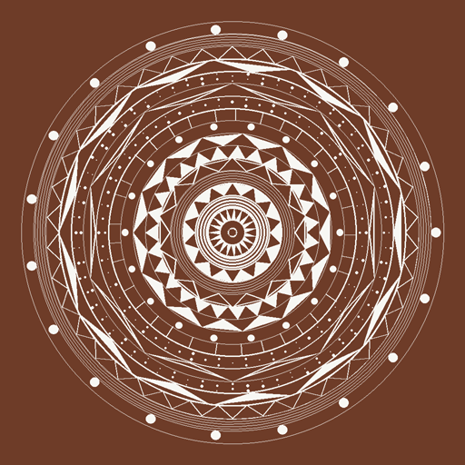

# AlponaGen 🎨

[](https://doi.org/10.5281/zenodo.17921032)



**Version:** 1.0
**Author:** Aritro Shome  
**Date:** October 9, 2025

## Overview
AlponaGen is a fractal-based generative art engine designed to create intricate alpona/mandala-style images. The project uses mathematical patterns and modular design principles to produce stunning visuals. The main motive was to create a dataset of images of Alpona-s to potentially train models on them.

**⚠️ IF YOU'RE LOOKING for the ALPONA-GEN DATASET, visit [this Kaggle dataset](https://www.kaggle.com/datasets/ar1tr0/alpona-gen). This repository was used to generate that dataset.**

## Features ✨
- **Modular Design:** Separate files for generation engine and pattern drawing functions.
- **Customizable Output:** Specify width, height, and output directory via command-line arguments.
- **Multiple Styles:** Includes built-in styles like `alpona` and supports custom styles.
- **Layered Patterns:** Generate layers with triangles, circles, petals, spirals, and dots.
- **Randomized Art:** Each image is unique, thanks to randomization.

## Installation 🛠️
1. Clone the repository:
   ```bash
   git clone https://github.com/sortira/AlponaGen.git
   ```
2. Navigate to the project directory:
   ```bash
   cd AlponaGen
   ```
3. Install dependencies:
   ```bash
   pip install -r requirements.txt
   ```

## Usage 🚀
Run the `main.py` script with the following arguments:

```bash
python main.py -w 1024 -ht 1024 -out "output" -v
```

### Arguments:
- `-w` or `--width`: Width of the generated image.
- `-ht` or `--height`: Height of the generated image.
- `-out` or `--output`: Output directory for generated images.
- `-v` or `--version`: Display the program version.

## Examples 🌟
Generate 10 alpona-style images:
```bash
python main.py -w 800 -ht 800 -out "output" -v
```

## GUI Application 🎨

A GUI version of the Alpona Generator is now available! This application allows users to:
- Generate alpona images with customizable parameters (output directory, width, height, and image count).
- View generated images directly in the application with navigation controls.
- Delete the generated images and their directory with a single click.
- View logs of the generation process in real-time.

### Running the GUI
To launch the GUI application, run the `gui_alponagen.py` script:

```bash
python gui_alponagen.py
```

### Important:

**Ensure that the GUI executable or script (`gui_alponagen.py`) is in the same directory as `main.py` to ensure proper functionality.**

## Contributing 🤝
Feel free to fork the repository and submit pull requests. Contributions are welcome!

## License 📜
This project is licensed under the MIT License.

## Acknowledgments 🙌
Special thanks to:
- **Pillow** for image manipulation.
- **NumPy** for mathematical computations.

---
Enjoy creating beautiful alpona designs! 🎉
